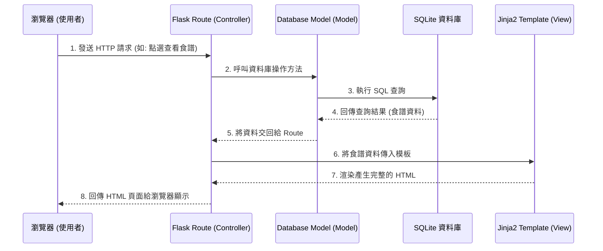

# 系統架構設計：數位食譜管理平台

## 1. 技術架構說明

本專案採用輕量級的 Python 網頁框架建置，以適合快速開發與小型專案的架構進行設計。

- **選用技術與原因**：
  - **後端：Python + Flask**：輕量且易於上手，非常適合用來快速建立食譜管理這類 CRUD（新增、讀取、更新、刪除）應用。
  - **前端（模板引擎）：Jinja2**：直接整合於 Flask 中，由後端負責將資料塞入 HTML 模板，不需維護複雜的前後端分離架構，降低開發門檻。
  - **資料庫：SQLite**：輕量級關聯式資料庫，不需要額外安裝伺服器軟體，資料儲存在單一檔案中，非常適合初學者與單機/輕量服務使用。
  - **前端樣式與互動**：使用純 CSS 搭配少許 JavaScript（若需）進行介面美化與基礎互動，以保持系統單純。

- **Flask MVC 模式說明**：
  在傳統的 MVC（Model-View-Controller）模式中，我們將職責劃分如下：
  - **Model (資料模型)**：負責定義資料庫結構與資料操作邏輯（例如：與 SQLite 的互動、建立「食譜」與「材料」等資料表）。
  - **View (視圖)**：負責呈現使用者介面，這裡指的是 Jinja2 的 HTML 模板。
  - **Controller (控制器)**：由 Flask 的 `routes`（路由）扮演。負責接收瀏覽器的請求、從 Model 取得資料、處理商業邏輯後，將結果傳遞給 View 進行渲染。

## 2. 專案資料夾結構

建議的資料夾結構如下，確保每個部分的職責清晰：

```text
web_app_development2/
├── app/                        # 應用程式主目錄
│   ├── __init__.py             # 初始化 Flask 應用程式的設定
│   ├── models/                 # 資料庫模型 (Model)
│   │   └── schema.sql          # 建立 SQLite 資料表的 SQL 語法
│   ├── routes/                 # Flask 路由控制器 (Controller)
│   │   ├── __init__.py
│   │   └── recipe_routes.py    # 處理食譜相關的路由邏輯
│   ├── templates/              # Jinja2 HTML 模板 (View)
│   │   ├── base.html           # 共用的基本頁面版型 (Header/Footer)
│   │   ├── index.html          # 首頁 / 食譜列表
│   │   ├── recipe_detail.html  # 食譜詳細內容
│   │   └── recipe_form.html    # 新增 / 編輯食譜的表單
│   └── static/                 # 靜態資源檔案
│       ├── css/
│       │   └── style.css       # 網站樣式設定
│       ├── js/
│       │   └── main.js         # 前端基礎互動邏輯
│       └── images/             # 食譜圖片上傳與存放處
├── instance/                   # 存放應用程式運行時產生的檔案 (勿加入版控)
│   └── database.db             # SQLite 資料庫檔案
├── docs/                       # 專案文件
│   ├── PRD.md                  # 產品需求文件
│   └── ARCHITECTURE.md         # 系統架構文件
├── app.py                      # 系統執行入口程式
└── requirements.txt            # Python 套件依賴清單 (如 flask)
```

## 3. 元件關係圖

以下展示使用者在瀏覽器操作時，系統各元件之間的互動流程：



## 4. 關鍵設計決策

1. **採用伺服器端渲染 (SSR)**：
   選擇由 Flask 透過 Jinja2 渲染 HTML，而非前端框架（如 React/Vue）搭配 API 的前後端分離架構。原因在於本專案（食譜管理）主要需求為資料的展示與基本編輯，採用 SSR 能讓開發更快速、架構更單純，非常適合新手或短時程專案。
2. **單一資料庫檔案 (SQLite)**：
   食譜管理系統通常資料量不大且沒有高併發寫入的需求。選擇 SQLite 能免去資料庫伺服器的建置與維護成本，讓開發者專注於功能實作，且備份或轉移專案非常方便（只需複製一個檔案）。
3. **MVC 分層結構**：
   將資料庫操作 (models)、網頁路由 (routes) 以及網頁畫面 (templates) 分拆到不同目錄。這能避免所有程式碼擠在同一個 `app.py` 中，確保日後擴充新功能時，依然能保持程式碼的可維護性與可讀性。
4. **統一的 Base Template 設計**：
   在 `templates/` 目錄中設計 `base.html` 作為母版。將共用的導覽列（Navbar）與頁尾（Footer）放在此處，其他所有頁面只需繼承 `base.html` 並填入中間的內容區塊。這避免了重複撰寫相同的 HTML 結構，讓畫面風格一致且好維護。
