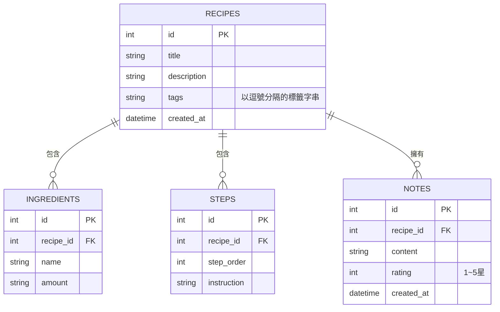

# 資料庫設計：數位食譜管理平台

## 1. ER 圖（實體關係圖）

## 2. 資料表詳細說明

### RECIPES (食譜表)
- `id` (INTEGER): 主鍵 (Primary Key)，自動遞增。
- `title` (TEXT): 食譜名稱，必填。
- `description` (TEXT): 食譜簡介。
- `tags` (TEXT): 標籤，以逗號分隔的字串（例如 "中式,減脂"），方便簡單的關鍵字搜尋與過濾。
- `created_at` (DATETIME): 建立時間，預設為資料寫入當下時間。

### INGREDIENTS (材料表)
- `id` (INTEGER): 主鍵，自動遞增。
- `recipe_id` (INTEGER): 外鍵 (Foreign Key)，對應 `RECIPES.id`。設定為 `ON DELETE CASCADE`，當食譜刪除時一併刪除。
- `name` (TEXT): 材料名稱（例如 "雞胸肉"），必填。
- `amount` (TEXT): 份量與單位（例如 "300g"）。

### STEPS (步驟表)
- `id` (INTEGER): 主鍵，自動遞增。
- `recipe_id` (INTEGER): 外鍵，對應 `RECIPES.id`。
- `step_order` (INTEGER): 步驟順序（例如 1, 2, 3...），必填。
- `instruction` (TEXT): 步驟詳細說明，必填。

### NOTES (筆記與評價表)
- `id` (INTEGER): 主鍵，自動遞增。
- `recipe_id` (INTEGER): 外鍵，對應 `RECIPES.id`。
- `content` (TEXT): 實作後的筆記與心得。
- `rating` (INTEGER): 評價星數 (1~5)，可用於篩選優質食譜。
- `created_at` (DATETIME): 建立時間。

## 3. SQL 建表與 Python Model 結構

我們已經將 SQL 建表語法產出在 `database/schema.sql`。
並為每一個資料表在 `app/models/` 資料夾下建立了對應的 Python 操作模型。
- `database/schema.sql`：SQL 建表語法
- `app/models/db.py`：負責取得 SQLite 連線
- `app/models/recipe.py`：食譜的 CRUD 邏輯
- `app/models/ingredient.py`：材料的 CRUD 邏輯
- `app/models/step.py`：步驟的 CRUD 邏輯
- `app/models/note.py`：筆記評價的 CRUD 邏輯
