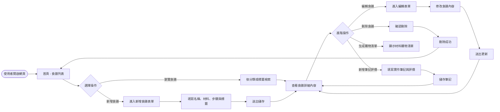
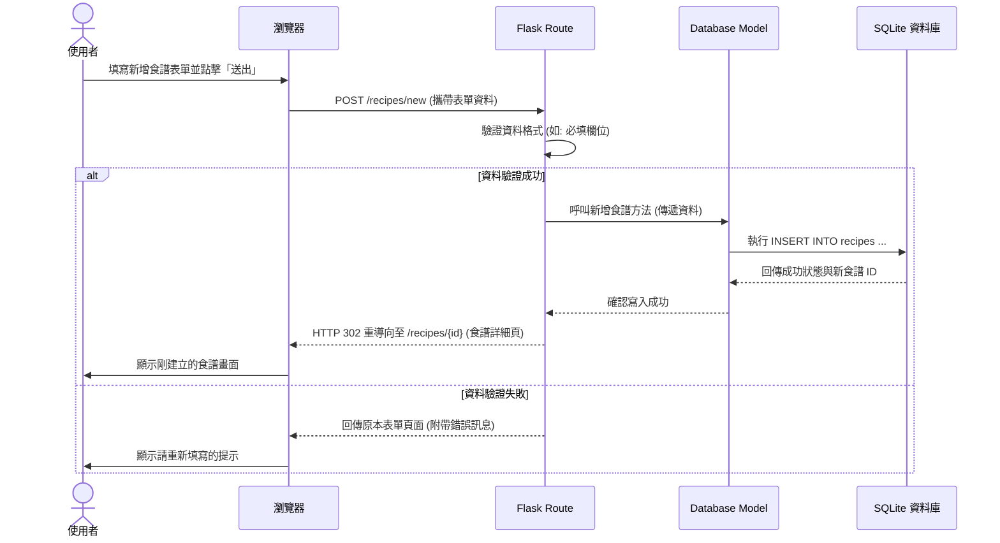

# 流程圖設計：數位食譜管理平台

## 1. 使用者流程圖（User Flow）

以下流程圖展示了使用者在平台上進行主要操作的路徑，涵蓋食譜的瀏覽、新增、檢視、編輯及刪除等核心功能。

## 2. 系統序列圖（Sequence Diagram）

以下序列圖描述「使用者點擊新增食譜」到「資料存入資料庫」的完整技術流程：

## 3. 功能清單對照表

根據系統功能，我們初步規劃以下的 URL 路徑與對應的 HTTP 請求方法：

| 功能項目 | HTTP 方法 | URL 路徑 | 說明 |
| --- | --- | --- | --- |
| **瀏覽食譜列表** | GET | `/` 或 `/recipes` | 顯示所有食譜，支援分類標籤檢索 |
| **查看食譜詳情** | GET | `/recipes/<int:id>` | 顯示單一食譜的詳細步驟、材料與筆記 |
| **新增食譜 (表單)** | GET | `/recipes/new` | 顯示用來新增食譜的空白表單 |
| **新增食譜 (處理)** | POST | `/recipes/new` | 接收表單資料並存入資料庫 |
| **編輯食譜 (表單)** | GET | `/recipes/<int:id>/edit` | 顯示帶有原資料的表單供修改 |
| **編輯食譜 (處理)** | POST | `/recipes/<int:id>/edit` | 接收修改後的資料並更新資料庫 |
| **刪除食譜** | POST | `/recipes/<int:id>/delete` | 從資料庫中刪除該筆食譜資料 |
| **生成購物清單** | GET | `/recipes/<int:id>/shopping-list` | 擷取食譜材料並整理成購物清單 |
| **新增筆記評價** | POST | `/recipes/<int:id>/notes` | 將實作筆記與評價附加到指定食譜 |
